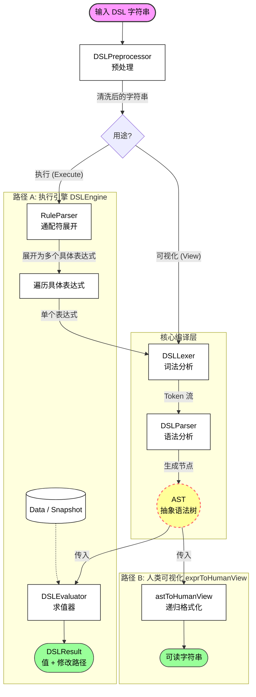

### DSL 解释器工作原理图

---

### 详细原理解析

整个流程像是一个流水线工厂，分为以下几个关键步骤：

#### 1. 预处理阶段 (Preprocessing)
*   **输入**: 原始的、可能包含大量格式化空格和换行的字符串。
  *   例如: `<<if> \n $[A] \n #[>] \n 10 >`
*   **组件**: `DSLPreprocessor`
*   **作用**:
  *   **清洗**: 去除所有无意义的空格、换行符、制表符，将代码压缩为紧凑格式。
  *   **保护**: 智能识别 `&[{str} hello world ]` 这种字面量，**保护**其中的空格不被误删。
*   **输出**: 标准化的单行字符串。
  *   例如: `<<if>$[A]#[>]10>`

#### 2. 分支决策 (Branching)
根据调用的是 `DSLHandler.execute` 还是 `exprToHumanView`，流程会走向不同的路径。

*   **路径 A (执行)**: 需要处理 `*` 通配符，针对实际数据进行计算。
*   **路径 B (可视化)**: 只需要解析语法结构，展示给用户看，不需要展开通配符（通常用户想看的就是 `角色.*.等级 > 10` 这一条规则本身）。

#### 3. 通配符展开 (Context-Aware Expansion) - *仅执行路径*
*   **组件**: `RuleParser`
*   **作用**: 扫描数据源，将包含 `*` 的抽象路径（如 `$[角色.*.HP]`）映射为数据中实际存在的具体路径（如 `$[角色.战士.HP]`, `$[角色.法师.HP]`）。
*   **结果**: 一个原始表达式可能分裂成 N 个具体表达式。

#### 4. 核心编译 (Compilation)
这是解释器的心脏，无论执行还是可视化都需要经过这一步。

*   **词法分析 (Lexer)**:
  *   将字符串切分成一个个最小语义单元 (**Token**)。
  *   输入: `$[A]#[+]1`
  *   输出: `[IDENTIFIER($[A]), OP_MATH(#[+]), LITERAL(1)]`
*   **语法分析 (Parser)**:
  *   根据运算符优先级（`OPERATOR_PRECEDENCE`），将 Token 流组装成树状结构 (**AST**)。
  *   它决定了 `1 + 2 * 3` 是先算乘法还是加法。

#### 5. 消费 AST (Consumption)

**场景一：求值 (Evaluator)**
*   **组件**: `DSLEvaluator`
*   **输入**: AST + `Data` (JSON 数据源)。
*   **逻辑**: 递归遍历 AST 节点。遇到 `Identifier` 就去 Data 里取值；遇到 `BinaryOp` 就进行数学或逻辑运算；遇到 `FunctionCall` 就执行内置函数。
*   **输出**: 计算结果（`true/false`, 数字等）以及可能的副作用（赋值操作修改了哪个路径）。

**场景二：可视化 (Human View)**
*   **组件**: `astToHumanView` (递归函数)
*   **输入**: AST。
*   **逻辑**:
  *   **反编译**: 将抽象的 AST 节点还原为人类习惯的字符串。
  *   **去噪**: 去掉 DSL 的特殊符号（如 `$[...]`, `#[...]`, `&[...]`）。
  *   **优先级处理**: 你的代码中非常巧妙的一点是 `parentPrecedence`。在还原时，如果发现子节点的运算符优先级低于父节点，会自动加上 `()`，保证生成的数学公式逻辑正确。
*   **输出**: `A + 1 > 10` 这样干净的字符串。
